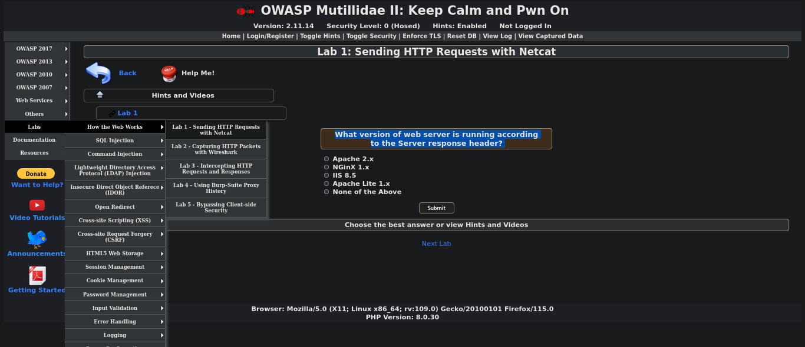

## Lab 1 - Sending HTTP Request wth Netcat




## Overview
The objective of this lab is to learn how to send HTTP requests using Netcat (nc) and interpret the server's response headers to gather information about the web server running on a specified host.

## Solution
To solve this lab we will use popular tool called Netcat also known as Swiss Army Nife tool. This tool has a lot of options available to use but we will use it on very simple and basic level.
```bash
kali@kali:~$ netcat -help
[v1.10-48.1]
connect to somewhere:	nc [-options] hostname port[s] [ports] ... 
listen for inbound:	nc -l -p port [-options] [hostname] [port]
options:
	-c shell commands	as `-e'; use /bin/sh to exec [dangerous!!]
	-e filename		program to exec after connect [dangerous!!]
	-b			allow broadcasts
	-g gateway		source-routing hop point[s], up to 8
	-G num			source-routing pointer: 4, 8, 12, ...
	-h			this cruft
	-i secs			delay interval for lines sent, ports scanned
        -k                      set keepalive option on socket
	-l			listen mode, for inbound connects
	-n			numeric-only IP addresses, no DNS
	-o file			hex dump of traffic
	-p port			local port number
	-r			randomize local and remote ports
	-q secs			quit after EOF on stdin and delay of secs
	-s addr			local source address
	-T tos			set Type Of Service
	-t			answer TELNET negotiation
	-u			UDP mode
	-v			verbose [use twice to be more verbose]
	-w secs			timeout for connects and final net reads
	-C			Send CRLF as line-ending
	-z			zero-I/O mode [used for scanning]
port numbers can be individual or ranges: lo-hi [inclusive];
hyphens in port names must be backslash escaped (e.g. 'ftp\-data').

``` 

We will simply type Netcat followed by IP address and specific port number. In our case, we have an IP of localhost (127.0.0.1) and port number 80 on which web server is running on.

```bash
kali@kali:~$ netcat 127.0.0.1 80                                                                                                        
GET /HTTP/1.1
HTTP/1.1 400 Bad Request
Date: Sat, 13 Jul 2024 19:25:11 GMT
Server: Apache/2.4.58 (Unix) OpenSSL/1.1.1w PHP/8.0.30 mod_perl/2.0.12 Perl/v5.34.1
Vary: accept-language,accept-charset
Accept-Ranges: bytes
Connection: close
Content-Type: text/html; charset=utf-8
Content-Language: en
Expires: Sat, 13 Jul 2024 19:25:11 GMT

<?xml version="1.0" encoding="UTF-8"?>
<!DOCTYPE html PUBLIC "-//W3C//DTD XHTML 1.0 Strict//EN"
  "http://www.w3.org/TR/xhtml1/DTD/xhtml1-strict.dtd">
<html>
<body>
.
.
.
</body>
</html>
```

When using Netcat (nc) to connect to a server running on port 443 (HTTPS), you might encounter a "400 Bad Request" error. This error occurs because Netcat lacks SSL/TLS support required for secure connections. HTTPS communication involves encryption, which Netcat cannot handle on its own.

To communicate with servers running on HTTPS (port 443), tools like openssl s_client are typically used. openssl s_client facilitates SSL/TLS negotiation and ensures secure communication channels. It's designed to handle the encryption protocols necessary for HTTPS.

For HTTP requests (port 80), Netcat (nc) works well. However, when dealing with HTTPS, openssl s_client is essential for establishing secure connections and avoiding "Bad Request" errors.
