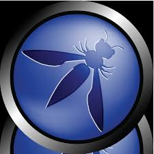

# Lab 1

## Overview
The objective of this lab is to learn how to send HTTP requests using Netcat (nc) and interpret the server's response headers to gather information about the web server running on a specified host.

