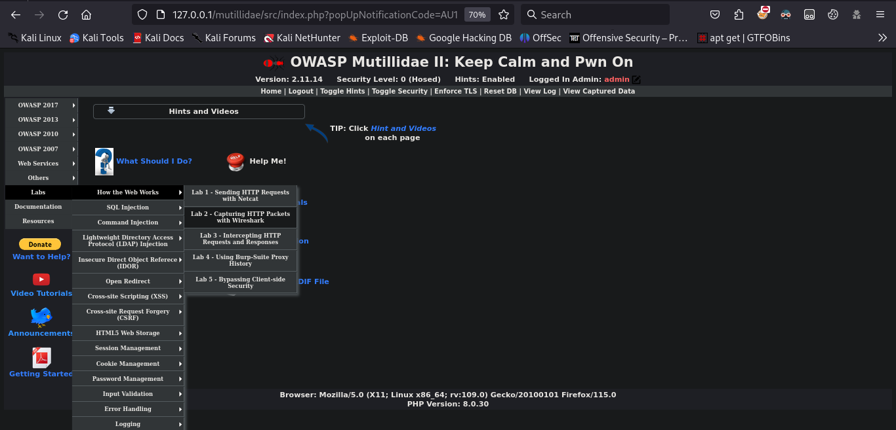

## Lab 2 - Capturing HTTP Packets with Wireshark

## Overview
The objective of this lab is to develop your skills in capturing and analyzing web traffic, with a focus on HTTP/HTTPS protocols. In this exercise, you will learn how to intercept and examine web traffic to understand the various elements involved in web communication.

A key aspect of this lab is identifying the user-agent, which provides critical information about the client software initiating the requests. By capturing and analyzing HTTP/HTTPS traffic, you will gain insights into the interaction between web browsers and servers, understand the structure of HTTP requests and responses, and learn to recognize different user-agents.

## Solution
To solve this lab, we will use a popular network protocol analyzer tool called Wireshark. Wireshark is widely used for network troubleshooting, analysis, software and communications protocol development, and education. It captures network traffic in real-time and displays it in a detailed and understandable format.

We will begin by setting up Wireshark on our system, ensuring it is properly configured to capture HTTP and HTTPS traffic. Once the setup is complete, we will start capturing traffic on the relevant network interface.

During the capture, we will perform various web activities to generate HTTP and HTTPS traffic. Wireshark will allow us to filter the captured packets, making it easier to isolate and analyze the traffic of interest. We will focus on examining the HTTP headers, particularly the 'User-Agent' header, which provides information about the browser and operating system of the client making the request.

Through this analysis, we will gain insights into the different types of user-agents accessing the web server and understand how they interact with it. This knowledge can be crucial for identifying and mitigating potential security threats and for optimizing the web server's performance and compatibility.

First we will fire up our browser and go to particular lab link. Meanwhile we will have Wirehsark running on and capturing HTTP traffic though loopback address.

As we see, we have a lot of HTTP traffic being captured in Wireshark. We are primarily interesed in find user-agent. To do this we will click on first packet and open  Hyper Text Transfer Protocol layer in left corner. Right under left corner we have user-agent Mozilla, which is correct anaswer.

*Happy Hacking*
